<a href="https://aifrontier.tech"></a>

I build open-source AI tools that do actual work, not demos: agent skills, MCP servers and systems that run inside a company's perimeter. The math runs in code, the data comes from real registries, and it all ships under MIT or Apache 2.0. I run [**AI Frontier**](https://aifrontier.tech), a small lab that puts practical AI into real companies.

<a href="https://github.com/ilyautov/humanizer-ru"></a>
<a href="https://github.com/ilyautov/inn-check-ru">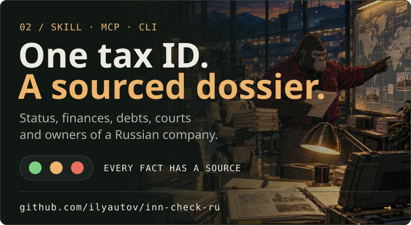</a>

<a href="https://github.com/ilyautov/cordon"></a>
<a href="https://github.com/ilyautov/small-business-ru"></a>

[**humanizer-ru**](https://github.com/ilyautov/humanizer-ru)  strips the AI fingerprint out of Russian text: bureaucratese, English calques, the tells that give ChatGPT and Claude away. It scores a text from 0 to 100 and shows which phrases gave it away. Try it in the browser at [humanizer-ru.aifrontier.tech](https://humanizer-ru.aifrontier.tech/). Same thing for Italian: [humanizer-it](https://github.com/ilyautov/humanizer-it).

[**inn-check-ru**](https://github.com/ilyautov/inn-check-ru) gives your agent a Russian tax ID and gets back a company dossier: status, finances, debts, court cases, owners and links. Every fact carries its source and date, and whatever could not be checked stays visible. Skill, MCP server and CLI. [inn-check-ru.aifrontier.tech](https://inn-check-ru.aifrontier.tech/)

[**cordon**](https://github.com/ilyautov/cordon) is a prompt-injection firewall with no AI inside. Web pages, emails, issues and tool results can carry orders aimed at your agent; Cordon lets the agent read them and stops it acting on them. Plain code decides, so it cannot be talked round. Adapters for Claude Code, Codex CLI, Gemini CLI, MCP hosts and LangChain. [cordon.aifrontier.tech](https://cordon.aifrontier.tech/en/)

[**small-business-ru**](https://github.com/ilyautov/small-business-ru) is 34 skills for Russian small businesses: taxes, cash, contracts, checking a counterparty. The numbers get computed, not guessed. [small-business-ru.aifrontier.tech](https://small-business-ru.aifrontier.tech/)

<a href="https://github.com/ilyautov/marketplaces-mcp-ru"></a>

<a href="https://github.com/ilyautov/marketplaces-mcp-ru">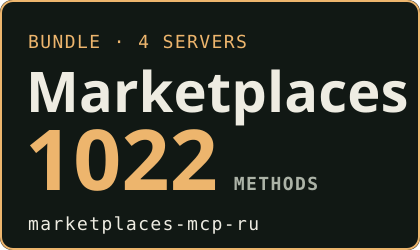</a>

<a href="https://github.com/ilyautov/wildberries-mcp-ru">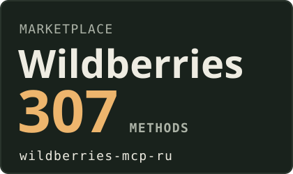</a>

<a href="https://github.com/ilyautov/moysklad-mcp-ru">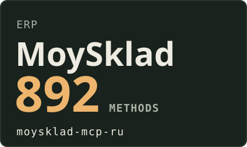</a>
<a href="https://github.com/ilyautov/business-mcp-ru">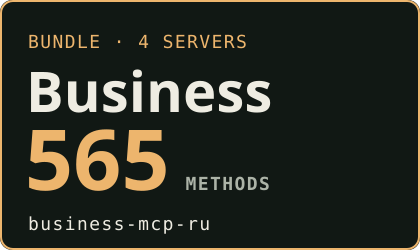</a>
<a href="https://github.com/ilyautov/hh-mcp-ru">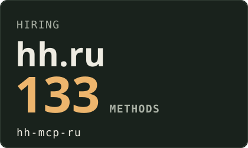</a>
<a href="https://github.com/ilyautov/vk-mcp-ru">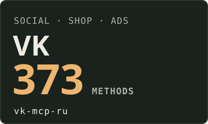</a>
<a href="https://github.com/ilyautov/diadoc-mcp-ru">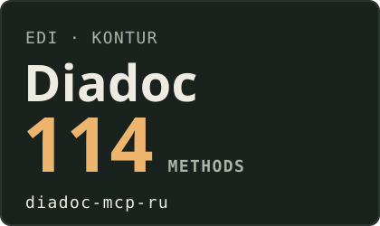</a>
<a href="https://github.com/ilyautov/sbis-mcp-ru">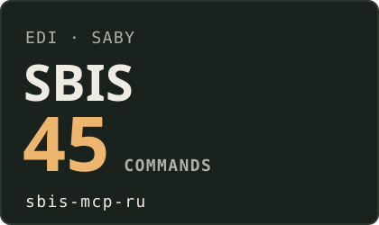</a>
<a href="https://github.com/ilyautov/chestny-znak-mcp-ru">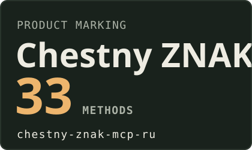</a>

MCP servers that wire Claude, Cursor or Codex straight into the systems a Russian company runs on, over the official APIs: no browser, no scraping, a safety gate before anything gets written. Take a bundle or just the one service you need. The marketplace and business servers share one engine, [schema-mcp-core](https://github.com/ilyautov/schema-mcp-core), so a safety fix lands in all of them at once. Method maps, API keys and the errors that eat the most time are written up per service at [marketplaces-mcp-ru.aifrontier.tech](https://marketplaces-mcp-ru.aifrontier.tech/), [business-mcp-ru.aifrontier.tech](https://business-mcp-ru.aifrontier.tech/) and [moysklad-mcp-ru.aifrontier.tech](https://moysklad-mcp-ru.aifrontier.tech/).

**Also**

[**hefest**](https://github.com/ilyautov/hefest). Chemical safety for an industrial plant, fully offline: emergency cards, hazard zones, storage compatibility, protective gear. It refuses to answer without grounds, because here an error costs somebody's health.

[**consilium-principis**](https://github.com/ilyautov/consilium-principis). An advisory board of historical thinkers. Every quote is checked word for word against public-domain sources, or the board keeps quiet.

[**doc2md**](https://github.com/ilyautov/doc2md). Batch-converts Word, Excel, PowerPoint, PDF, EPUB, RTF and CSV into clean Markdown before the agent reads them.

[**rusvoice**](https://github.com/ilyautov/rusvoice). Russian voice-over in your own voice, with the layer before synthesis that was missing: stress marks, a brand dictionary, abbreviations read letter by letter.

All of it plugs into Claude Code, Cursor, Codex and other agents. The full list, grouped by what it does, is at [ilyautov.github.io](https://ilyautov.github.io/).

**Star the one you'd actually use.** Then come find me at [aifrontier.tech](https://aifrontier.tech), on [LinkedIn](https://www.linkedin.com/in/ilyautov), or on [Telegram](https://t.me/gorilla_under_hood), where I write up how the whole thing gets built.

🇷🇺 По-русски

 

Пишу открытые AI-инструменты, которые делают работу, а не крутят демо: скиллы для агентов, MCP-серверы и системы, которые работают внутри контура предприятия. Считает всё код, данные берутся из настоящих реестров, лицензии MIT и Apache 2.0. Веду лабораторию [**AI Frontier**](https://aifrontier.tech): маленькая команда, которая заводит ИИ в реальные компании.

[**humanizer-ru**](https://github.com/ilyautov/humanizer-ru) вычищает из русского текста следы нейросети: канцелярит, кальки, обороты, по которым сразу видно ChatGPT и Claude. Ставит тексту балл от 0 до 100 и показывает, что его выдало. Попробовать в браузере: [humanizer-ru.aifrontier.tech](https://humanizer-ru.aifrontier.tech/). То же для итальянского: [humanizer-it](https://github.com/ilyautov/humanizer-it).

[**inn-check-ru**](https://github.com/ilyautov/inn-check-ru): даёшь агенту ИНН, получаешь досье компании. Статус, финансы, долги, суды, владельцы и связи, у каждого факта источник и дата, непроверенное видно. Скилл, MCP-сервер и CLI. [inn-check-ru.aifrontier.tech](https://inn-check-ru.aifrontier.tech/)

[**cordon**](https://github.com/ilyautov/cordon): файрвол от промпт-инъекций без ИИ внутри. В письме, на странице или в задаче может сидеть чужая команда для агента. Cordon даёт агенту это прочитать и не даёт выполнить. Решает обычный код, поэтому его не уговоришь. Адаптеры для Claude Code, Codex CLI, Gemini CLI, MCP-хостов и LangChain. [cordon.aifrontier.tech](https://cordon.aifrontier.tech/)

[**small-business-ru**](https://github.com/ilyautov/small-business-ru): 34 скилла для малого бизнеса: налоги, деньги, договоры, проверка контрагента. Цифры считает код, а не выдумывает модель. [small-business-ru.aifrontier.tech](https://small-business-ru.aifrontier.tech/)

**MCP-серверы** подключают Claude, Cursor или Codex прямо к системам, на которых работает российская компания, через официальные API: без браузера и парсинга, с гейтом безопасности перед любой записью. Можно взять сборник, а можно один нужный сервис:

- маркетплейсы: сборник [marketplaces-mcp-ru](https://github.com/ilyautov/marketplaces-mcp-ru) (1022 метода) или по отдельности [Ozon](https://github.com/ilyautov/ozon-mcp-ru), [Wildberries](https://github.com/ilyautov/wildberries-mcp-ru), [Яндекс Маркет](https://github.com/ilyautov/yandex-market-mcp-ru), [Авито](https://github.com/ilyautov/avito-mcp-ru);
- учёт: [МойСклад](https://github.com/ilyautov/moysklad-mcp-ru), 892 метода через десять общих инструментов, черновик прежде, чем документ будет проведён;
- деловые сервисы: сборник [business-mcp-ru](https://github.com/ilyautov/business-mcp-ru) (698 методов) или по отдельности [hh.ru](https://github.com/ilyautov/hh-mcp-ru), [VK](https://github.com/ilyautov/vk-mcp-ru), [Диадок](https://github.com/ilyautov/diadoc-mcp-ru), [СБИС](https://github.com/ilyautov/sbis-mcp-ru), [Честный знак](https://github.com/ilyautov/chestny-znak-mcp-ru).

Общее ядро [schema-mcp-core](https://github.com/ilyautov/schema-mcp-core): правка безопасности чинит все серверы сразу. Карты методов, где брать ключи и что значат частые ошибки, разобраны на [marketplaces-mcp-ru.aifrontier.tech](https://marketplaces-mcp-ru.aifrontier.tech/), [business-mcp-ru.aifrontier.tech](https://business-mcp-ru.aifrontier.tech/) и [moysklad-mcp-ru.aifrontier.tech](https://moysklad-mcp-ru.aifrontier.tech/).

**Ещё**

[**hefest**](https://github.com/ilyautov/hefest). Химическая безопасность завода, целиком офлайн: аварийные карточки, зоны заражения, совместимость хранения, подбор СИЗ. Без оснований не отвечает: ошибка тут стоит здоровья.

[**consilium-principis**](https://github.com/ilyautov/consilium-principis). Совет исторических мыслителей. Каждая цитата сверяется дословно с источником в общественном достоянии, иначе совет молчит.

[**doc2md**](https://github.com/ilyautov/doc2md). Пакетно превращает Word, Excel, PowerPoint, PDF, EPUB, RTF и CSV в чистый Markdown до того, как их прочитает агент.

[**rusvoice**](https://github.com/ilyautov/rusvoice). Русская озвучка своим голосом и слой перед синтезом, которого не хватало: ударения, словарь брендов, аббревиатуры по буквам.

Всё работает с Claude Code, Cursor, Codex и другими агентами. Полный список по назначению: [ilyautov.github.io](https://ilyautov.github.io/).

